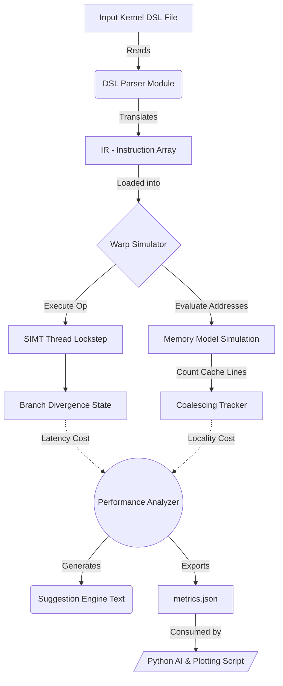
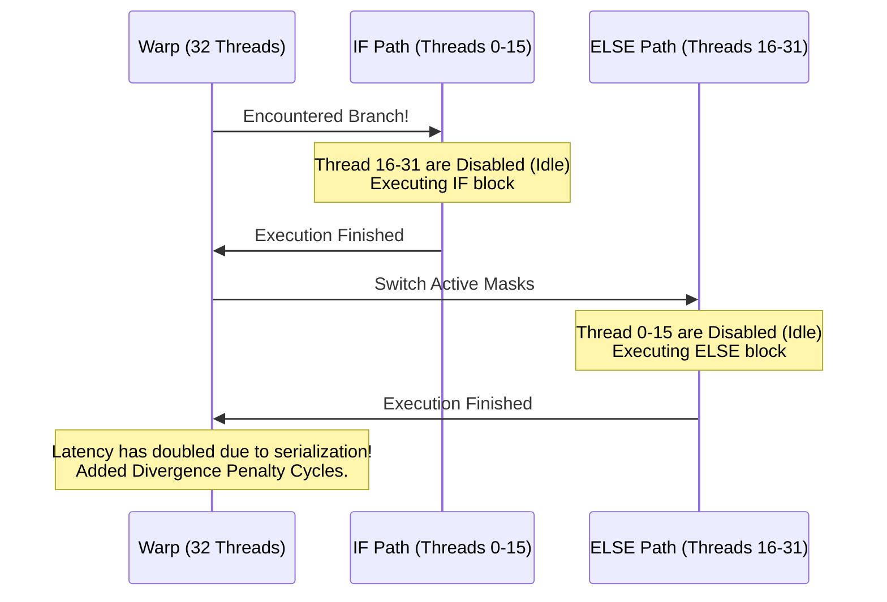

# GPU Kernel Optimization Simulator


A highly modular software-level simulator designed to emulate GPU core behavior, execute custom kernel syntax, and surface low-level algorithmic inefficiencies.

---

## 📖 Table of Contents
- [Scope of the Project](#-scope-of-the-project)
- [What It Solves](#-what-it-solves)
- [Our Approach & Architecture](#-our-approach--architecture)
- [Limitations](#-limitations)
- [Input and Output Structure](#-input-and-output-structure)
- [How to Run](#-how-to-run)

---

## 🎯 Scope of the Project

The transition from single-threaded CPU coding to massively parallel Compute Unified Device Architecture (CUDA) programming bridges an intellectual gap regarding hardware behavior. 

This project simulates the core principles of GPU execution topologies without requiring physical compute architectures or extensive CUDA C dialect installations. 
**The scope covers:**
- Emulating threads packaged dynamically into **Warps** (32 workers).
- Mimicking Single Instruction, Multiple Threads (**SIMT**) execution lockstep.
- Catching **Warp Divergence** penalties when threads in a single warp branch off into `IF/ELSE` forks.
- Tracking spatial memory layouts to monitor **Coalesced Memory Access** (minimizing array fetching trips to cache lines).

---

## 🛠 What It Solves

When engineers write parallel code, they often assume thousands of threads execute randomly. They miss critical pipeline penalties. This tool solves this learning and optimization barrier by:
1. **Providing Visibility:** Making invisible hardware delays (like serializing a branched warp) visible via calculated penalties.
2. **Automated Auditing:** Acting as a "linter" for parallelism, automatically telling the user *why* an algorithm is slow (e.g., "Your threads are striding memory, breaking coalescing").
3. **Safe Sandbox Execution:** Prototyping kernel ideas and logic mathematically without the overhead of spinning up NVCC compilers.

---

## 🏗 Our Approach & Architecture

The system uses a completely modular C++ object-oriented backend to crunch execution cycles natively, communicating its findings via JSON to a Python presentation engine.

### System Flowchart


### The SIMT Divergence Penalty Explained:


---

## 🚧 Limitations

1. **No Shared Memory Bank Conflicts:** Currently, the simulator does not model L1 shared memory bank conflicts dynamically. It focuses entirely on global cache line evaluation (Coalescing).
2. **Abstract DSL:** The simulator does not execute raw CUDA C++. Instead, it utilizes an intermediate representation DSL (e.g., `LOAD R1 A tid`) to simplify the parsing overhead and focus exclusively on core logic modeling.
3. **Mock Math Execution:** The `COMPUTE` layer acts as a timing placeholder incrementing cycles and registering mocks, rather than performing standard ALU (Arithmetic Logic Unit) float manipulations.

---

## 📁 Input and Output Structure

### Input Kernel (DSL Format)
You provide a simple layout mapping operations using our custom Domain Specific Language (DSL). Every operand on a line is separated by a space.

#### Supported Commands
1. **`LOAD <Register> <MemoryArray> <IndexMode>`** (e.g., `LOAD R1 A tid`)
   - Simulates reading data from the main GPU memory into a fast local register. It tests spatial locality; if all threads request `tid`, the access is coalesced.
2. **`STORE <MemoryArray> <IndexMode> <Register>`** (e.g., `STORE C tid R3`)
   - Simulates writing data from a register back to the main GPU memory. Same locality testing as `LOAD`.
3. **`COMPUTE <DestinationReg> <Operand1> <Operator> <Operand2>`** (e.g., `COMPUTE R3 R1 * R2`)
   - Increments the cycle tracker imitating an Arithmetic Logic Unit (ALU) calculation delay.
4. **`BRANCH <Condition>`** (e.g., `BRANCH divergence_starts_here`)
   - Simulates an `IF/ELSE` divergence path. If a divergence condition is met, it penalizes the warp by adding serialization delay computation cycles.

> [!NOTE] 
> **Why only four commands?** This simulator is intentionally scoped to these four operations because they govern the absolute core of hardware bottlenecks: **Memory** (`LOAD`/`STORE`), **Execution Delay** (`COMPUTE`), and **Warp Divergence** (`BRANCH`). Keeping the instruction set tiny preserves clean architectural code suitable for educational and interview evaluation without bogging down into full compiler Abstract Syntax Tree (AST) complexities.

*Example of a badly unoptimized input `divergent_kernel.txt`:*
```text
BRANCH divergence_penalty_test
LOAD R1 A tid
LOAD R2 B tid
COMPUTE R3 R1 * R2
STORE C tid R3
BRANCH divergence_end
```

### Outputs
**1. Terminal Suggestions:**
```
Loading Kernel: input/divergent_kernel.txt...
--- PERFORMANCE METRICS ---
Latency (Cycles):     16
Divergence Penalty:   40 cycles
Coalescing Efficiency:100%
Occupancy:            12.5%
---------------------------
--- OPTIMIZATION SUGGESTIONS ---
[*] High Warp Divergence detected. Suggestion: Minimize branches within warps, or refactor conditionals to avoid thread execution serialization.
```
**2. Extracted `metrics.json`:**
```json
{
  "latency": 16,
  "divergence": 40,
  "coalescing_efficiency": 1,
  "occupancy": 0.125
}
```

---

## 🚀 How to Run

### 1. Requirements
Ensure you have the following installed on your machine:
- `g++` (Supported C++17 Compiler)
- Python 3.x
- `matplotlib` (Install via `pip install matplotlib`)

### 2. Compilation
```bash
make
```
*(On Windows environments without Make, compile manually:)*
```bash
g++ -std=c++17 -Wall -I. main.cpp parser/parser.cpp core/warp_simulator.cpp analyzer/performance_analyzer.cpp analyzer/suggestion_engine.cpp -o gpu_simulator.exe
```

### 3. Execution
You will run the compiled binary, passing it the kernel text file. Then, run the Python visualization module.

**Running the Baseline "Good" Kernel:**
```bash
./gpu_simulator input/vector_add.txt
python3 ai/analyze_metrics.py
```

**Running the Bottlenecked "Bad" Kernel:**
```bash
./gpu_simulator input/divergent_kernel.txt
python3 ai/analyze_metrics.py
```

The Python script will interpret the heuristic signals, output a global "Kernel Health Score", and drop an algorithmic health bar chart neatly into the `output/performance_chart.png` directory.
